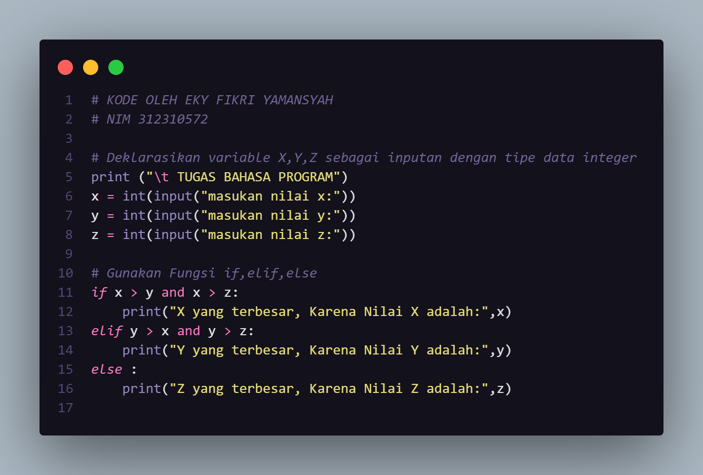
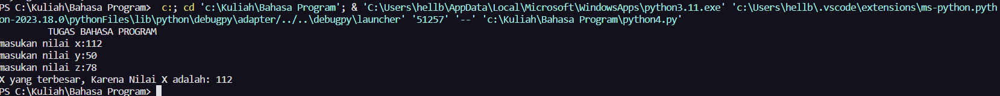
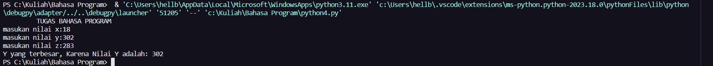
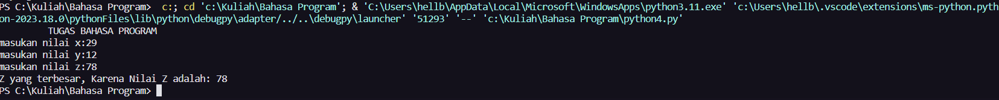
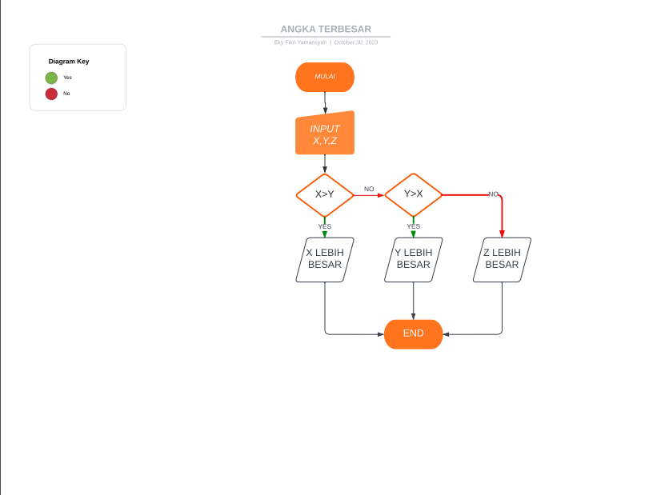

# labspy02
<h1>Angka Terbesar Dari 3 Bilangan</h1>

+ 
Pertama Buka IDE

+ 
Deklarasikan variable X,Y,Z sebagai inputan dengan tipe data integer

+ 
Gunakan Fungsi if, elif, else untuk membuat suatu kondisi

+ 
Program membandingkan nilai X dengan nilai Y dan Z, serta membandingkan nilai Y dengan nilai X dan Z, untuk menentukan mana yang terbesar di antara ketiganya.

+ 
Jika X lebih besar dari Y dan Z, maka program akan mencetak pesan bahwa X adalah nilai terbesar. Jika Y lebih besar dari X dan Z, program akan mencetak pesan bahwa Y adalah nilai terbesar. Jika tidak ada kondisi yang terpenuhi, program akan mencetak pesan bahwa Z adalah nilai terbesar.

# Kode

# Output

X lebih besar

Y lebih besar

Z lebih besar

# Flowchart

