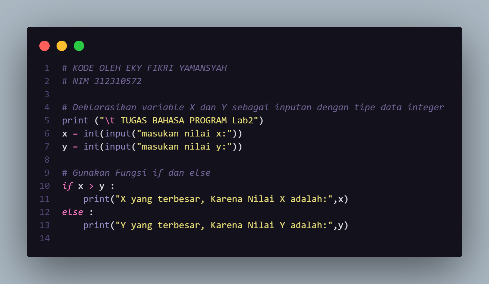
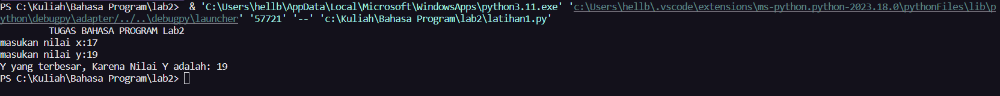
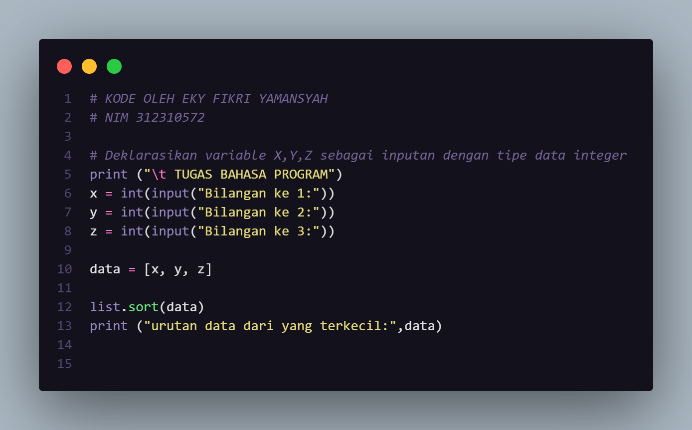
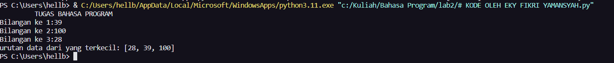
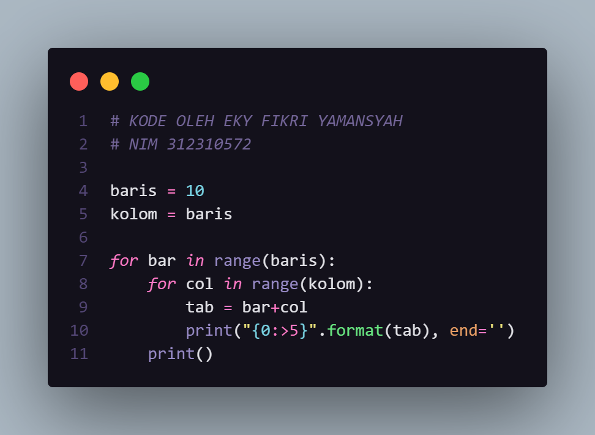
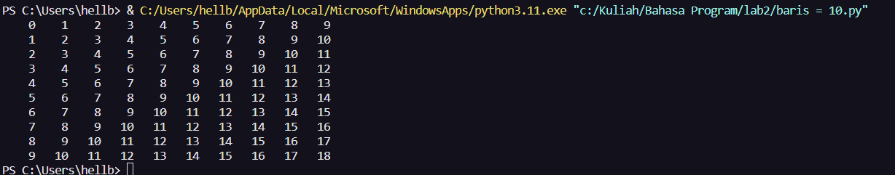
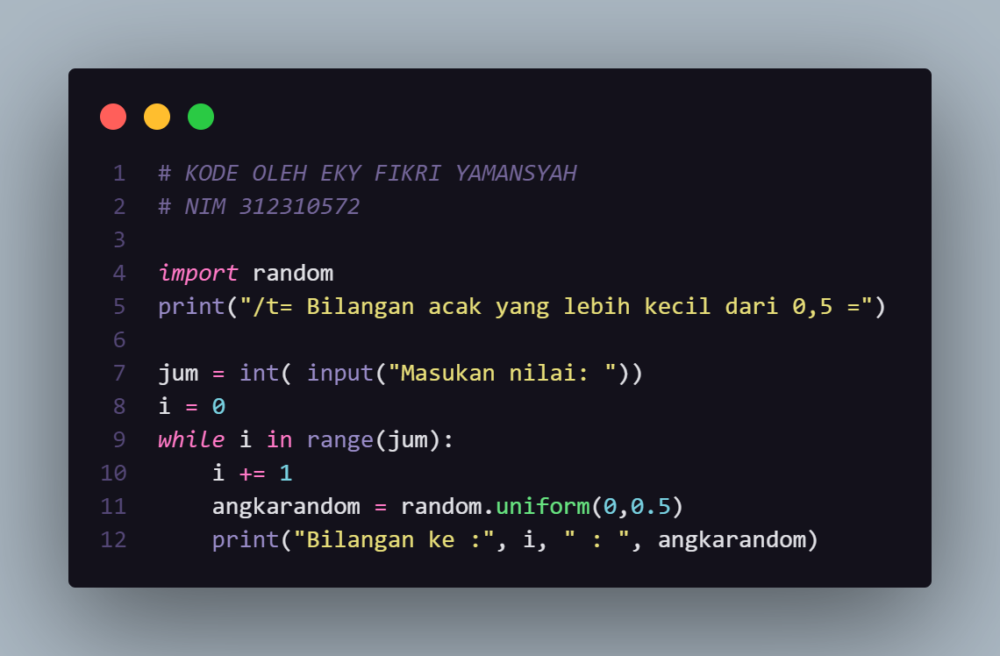
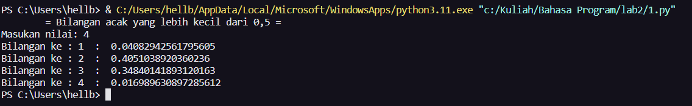

# labspy02
<h1>Angka Terbesar Dari 3 Bilangan</h1>

+ 
Pertama Buka IDE

+ 
Deklarasikan variable X,Y,Z sebagai inputan dengan tipe data integer

+ 
Gunakan Fungsi if, elif, else untuk membuat suatu kondisi

+ 
Program membandingkan nilai X dengan nilai Y dan Z, serta membandingkan nilai Y dengan nilai X dan Z, untuk menentukan mana yang terbesar di antara ketiganya.

+ 
Jika X lebih besar dari Y dan Z, maka program akan mencetak pesan bahwa X adalah nilai terbesar. Jika Y lebih besar dari X dan Z, program akan mencetak pesan bahwa Y adalah nilai terbesar. Jika tidak ada kondisi yang terpenuhi, program akan mencetak pesan bahwa Z adalah nilai terbesar.

### Kode

### Output

X lebih besar

Y lebih besar

Z lebih besar

### Flowchart

# Lab2
## Latihan1
*Buat program sederhada dengan input 2 buah bilangan, kemudian
 tentukan bilangan terbesar dari kedua bilangan tersebut
 menggunakan statement if.*
### KODE

### OUTPUT

## Latihan2
*Buat program untuk mengurutkan data berdasarkan input sejumlah
 data (minimal 3 variable input atau lebih), kemudian tampilkan
 hasilnya secara berurutan mulai dari data terkecil.*
### KODE

### OUTPUT

# Lab3
## Latihan 1
*Buat program dengan perulangan bertingkat (nested) for yang 
menghasilkan output sebagai berikut:*

### KODE

### OUTPUT

## Latihan 2
*Tampilkan n bilangan acak yang lebih kecil dari 0.5.* 
*nilai n diisi pada saat runtime*
*anda bisa menggunakan kombinasi while dan for untuk
 menyelesaikannya.*

 ### KODE

### OUTPUT

